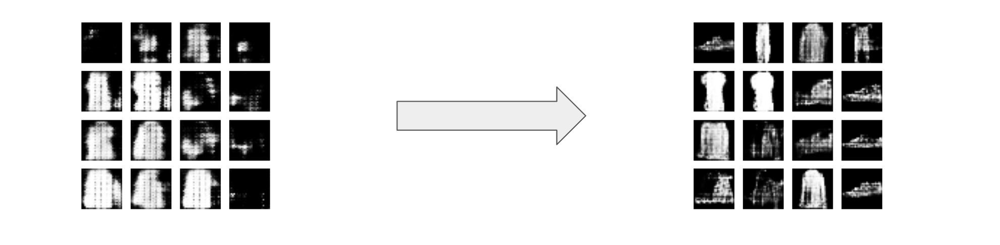
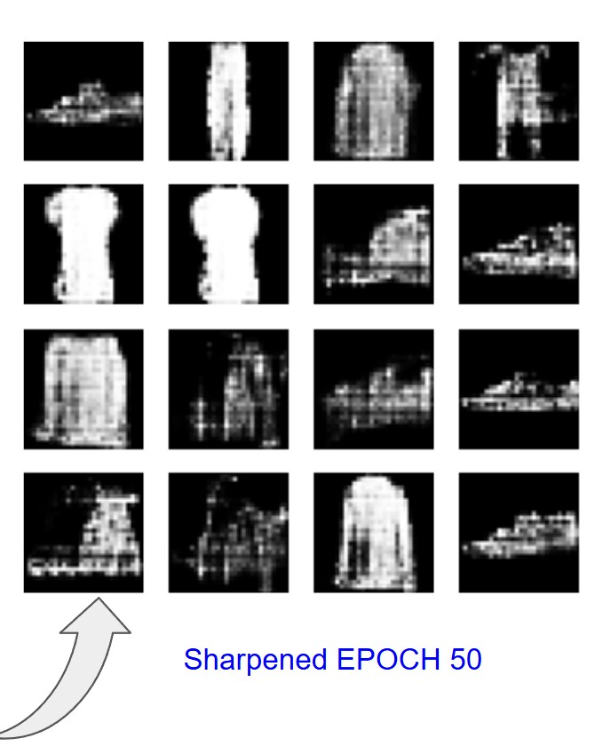
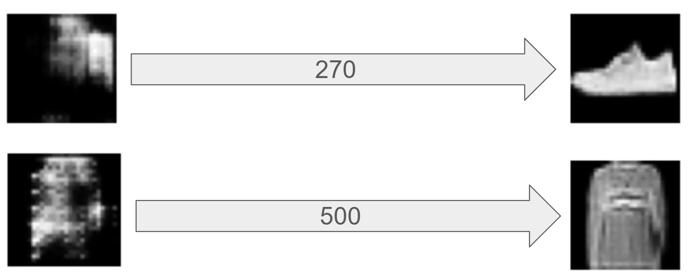

# Fashion-MNIST GAN Synthesis

This repository contains a **Deep Convolutional Generative Adversarial Network (DCGAN)** implementation designed to synthesize 28x28 grayscale images of clothing items. This project was developed as a final technical project for the Master 2 AI application at Paris-Saclay.

## 🚀 Project Overview
The goal is to train a Generator to create realistic fashion silhouettes from random noise, while a Discriminator learns to distinguish between real data and synthetic outputs.

### Key Features
* **Architecture:** DCGAN with Transposed Convolutions, Batch Normalization, and LeakyReLU activations.
* **M2 Engineering:** Integrated **FastAPI** for model serving and **Docker** for environment reproducibility.
* **Post-Processing:** Custom sharpening pipeline using PIL (ImageEnhance) to resolve semantic blurring.

## 📊 Dataset: Fashion-MNIST
The model is trained on the Zalando Research Fashion-MNIST dataset:
* **Size:** 70,000 images (60,000 train / 10,000 test).
* **Format:** 28x28 Grayscale.
* **Preprocessing:** Pixel values normalized to the range [-1, 1].

Results & Visual Evolution

### 1. Training (Epoch 10 to 50 and beyond)
During the early stages, the model establishes the basic geometric structures of clothing. By Epoch 50, the adversarial game reaches a stable equilibrium.



### 2. Post-Processing: Sharpening Filter


### 3. Scaling & Long-Term Convergence (270 vs 500 Epochs)


## 📁 Repository Structure
* `PROJECT-GAN.ipynb`: Core training notebook containing the model architecture and custom training loop.
* `Dockerfile`: Container configuration for environment isolation.
* `requirements.txt`: Python dependencies.

## ⚙️ How to Run
1. Install dependencies: `pip install -r requirements.txt`
2. Run the notebook: `jupyter notebook PROJECT-GAN.ipynb`

### Using Docker
```bash
docker build -t gan-fashion-mnist .
docker run gan-fashion-mnist
